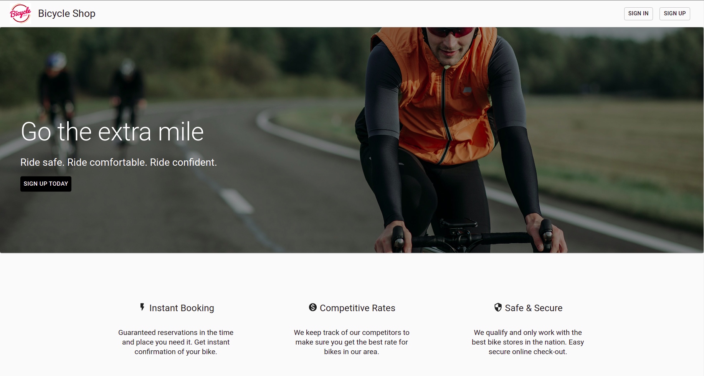
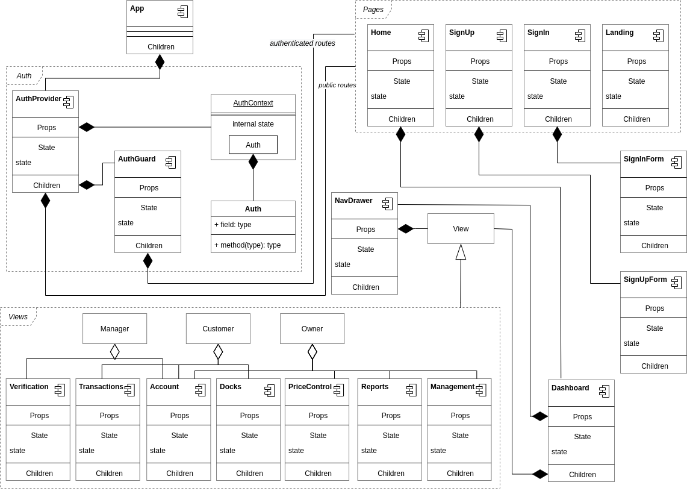
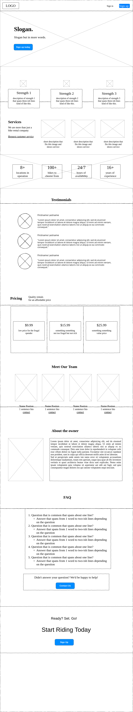
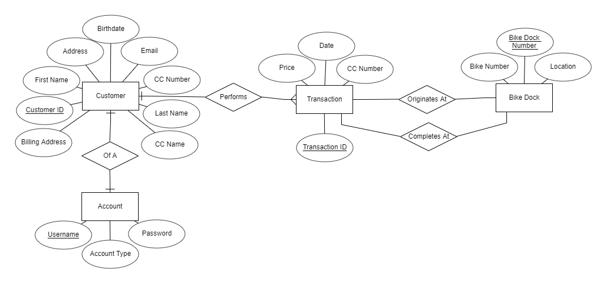
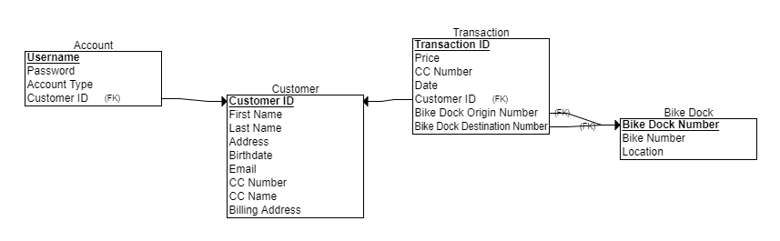
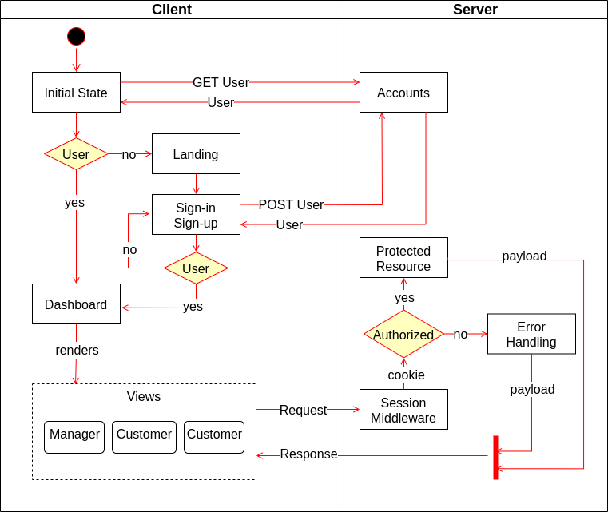

# Bike App



## Summary

A prototype web application for a bike rental company that allows:

- customers to rent and return bikes
- managers to add late fees to transactions
- the owner to view generated reports on transactions

Detailed project specs in <a href="./.assets/DesignDoc.pdf">Design Document</a>

## Design

### Frontend

<details>
    <summary>Frontend Design Diagram <em>(click to show/hide)</em></summary>
    
</details>
<details>
    <summary>Landing Page Wireframe <em>(click to show/hide)</em></summary>
    
</details>

<br>
More Details in<a href="https://github.com/alxford45/bike-app/tree/main/frontend"> Frontend Readme</a>

### Database

<details>
    <summary>ER Diagram <em>(click to show/hide)</em></summary>
    
</details>
<details>
    <summary>DB Model <em>(click to show/hide)</em></summary>
    
</details>

### Backend Integration



- Both client and server maintain user state through the use of an http cookie.
- The server uses Express-Sessions as middleware to map the cookie to an active user session.
- Following a valid sign-in request, the server attaches a cookie to the the response.
- All subsequent client requests include the attached cookie.
- When the client makes a request to a protected resource, the server is able to check if the active user session is authorized to receive the resource

## Git Strategy

```
BEGIN Sprint

    merge main -> backend
    merge main -> client
    merge client -> client-**

    PUSH CHANGES

    merge backend -> main
    merge client-xx -> client
    merge client -> main

END Sprint
```
